<div align="center">
    
</div>

# This is Mongo with Python app called MongoPass

## At Compass

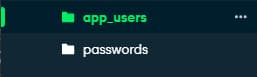
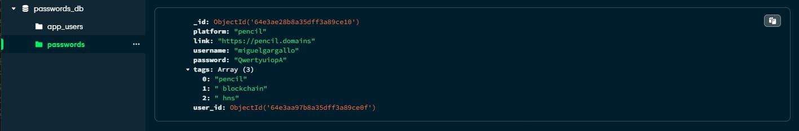

## CLI in action

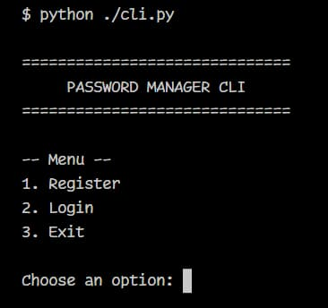

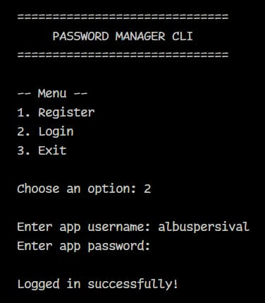
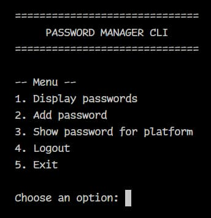
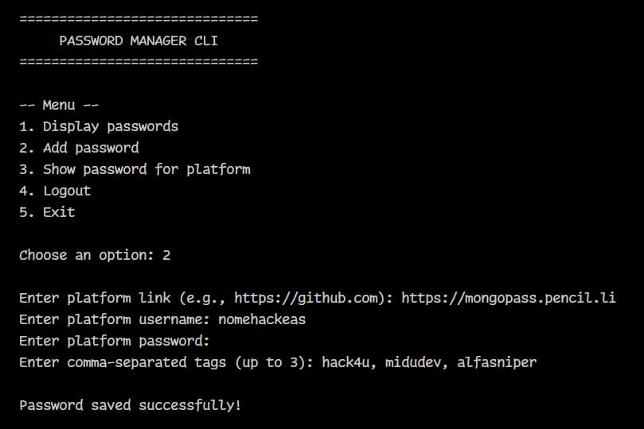
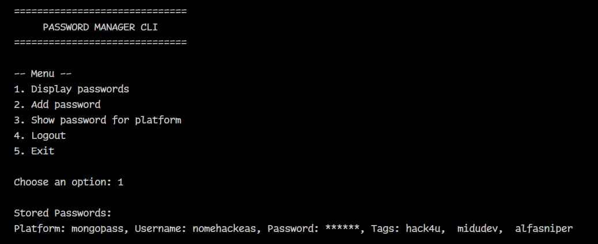
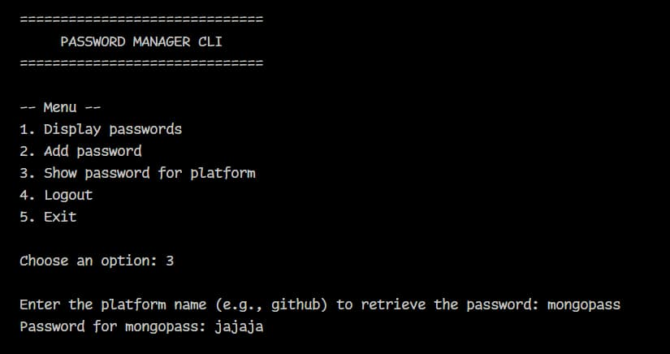

## GUI In action


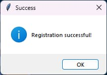

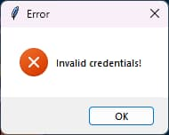
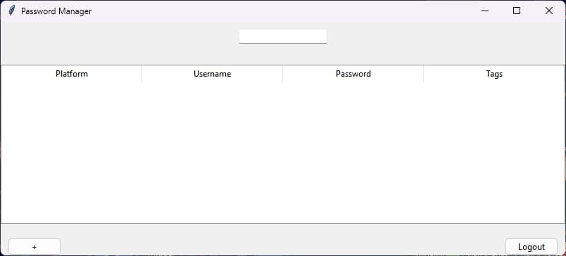
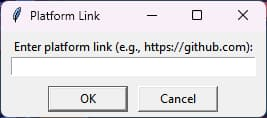
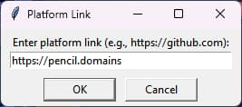
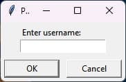
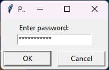
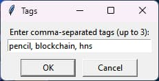
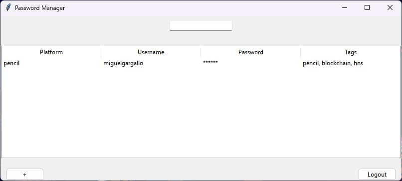

## First step, the .env

Please copy the `.env.example` file to `.env` and fill the variables with your own values.

```
cp .env.example .env
```

## To install and run the app

```
python -m venv venv
source ./venv/Scripts/activate
pip install pymongo bcrypt python-decouple
python ./gui.py
deactivate
```

## To run the app

```
python -m venv venv
source ./venv/Scripts/activate
python ./gui.py
deactivate
```

<div align="center">
    
</div>

## Pylar AI Creative ML Free License

This project is licensed under the [Pylar AI Creative ML Free License](LICENSE.md). For further details about this license, please visit the [official source HuggingFace/superdatas](https://huggingface.co/spaces/superdatas/free-license).
